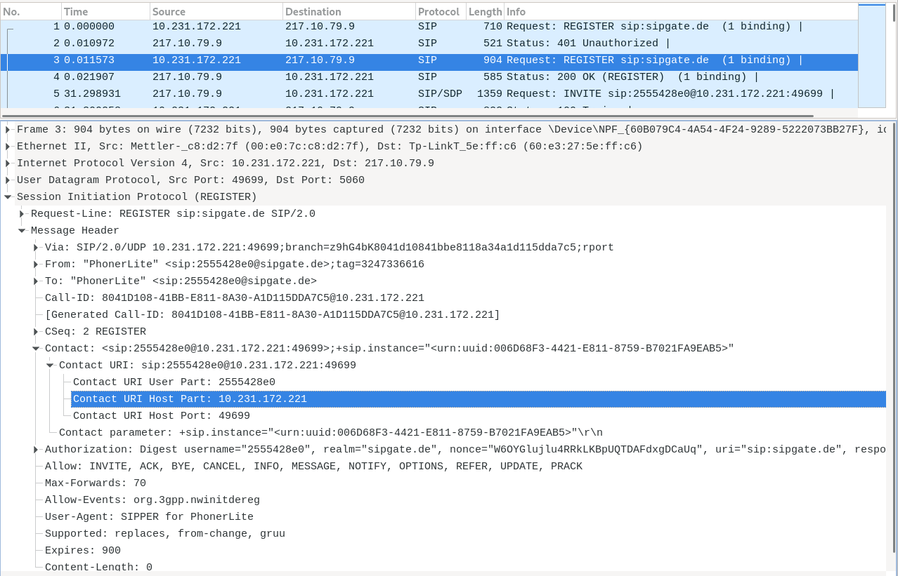
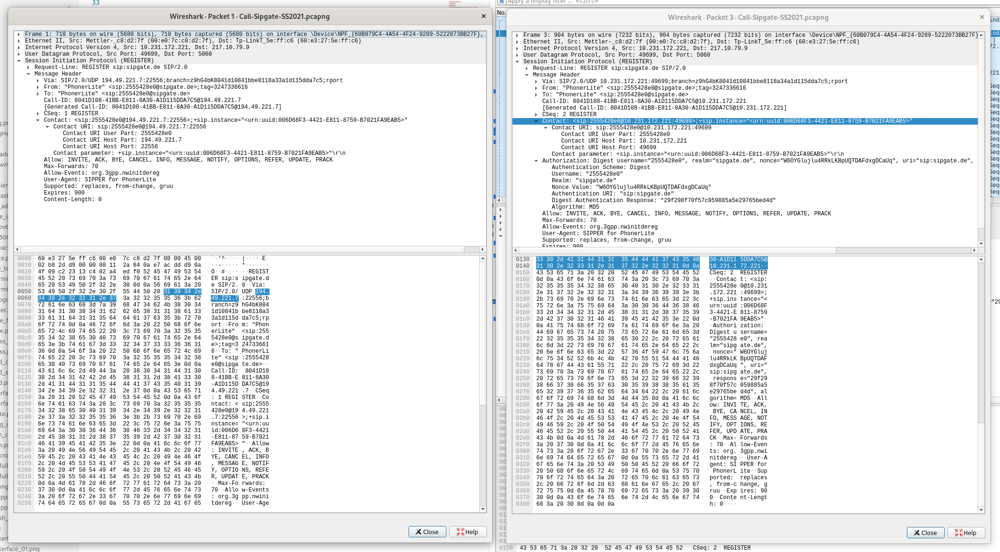
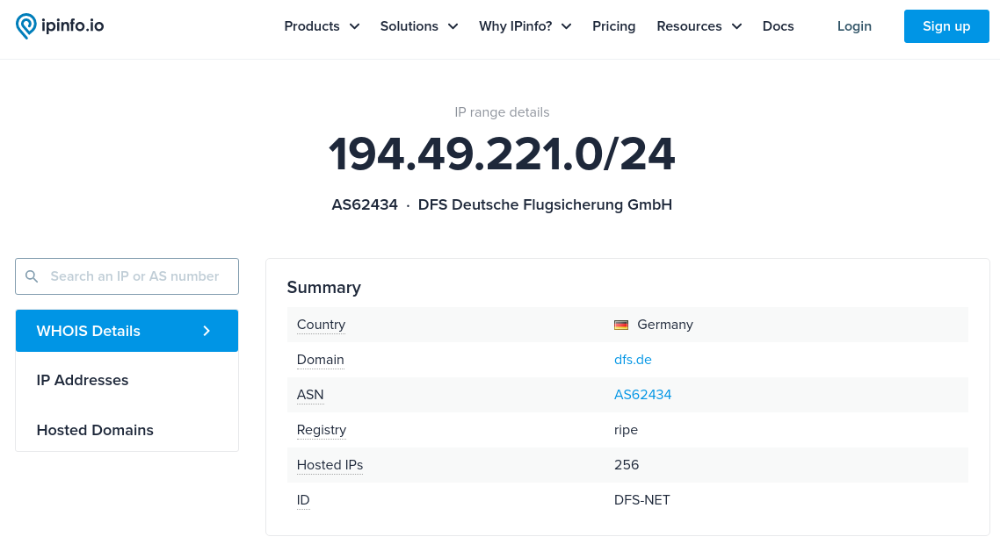
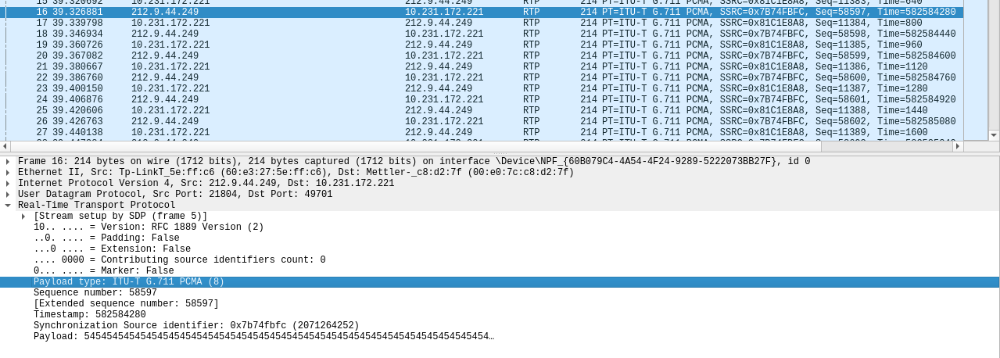
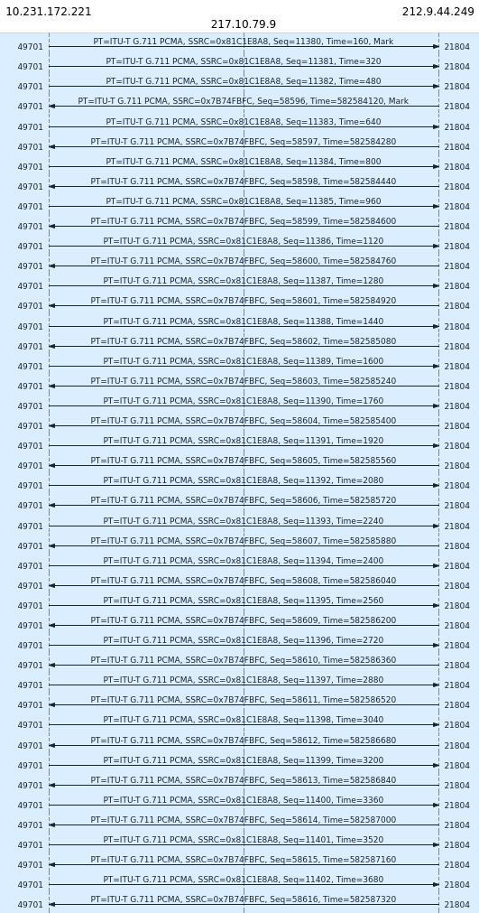

# Praktikum Rechnernetze

## Einführung

### Mitwirken

Diese Materialien basieren auf [Professor Kiefers "Praktikum Rechnernetze"-Vorlesung der HdM Stuttgart](https://www.hdm-stuttgart.de/vorlesung_detail?vorlid=j212254).

**Sie haben einen Fehler gefunden oder haben einen Verbesserungsvorschlag?** Bitte eröffnen Sie ein Issue auf GitHub ([github.com/pojntfx/uni-netpractice-notes](https://github.com/pojntfx/uni-netpractice-notes)):

{ width=150px }

Wenn ihnen die Materialien gefallen, würden wir uns über einen GitHub-Stern sehr freuen.

### Lizenz

Dieses Dokument und der enthaltene Quelltext ist freie Kultur bzw. freie Software.

{ width=128px }

Uni Network Practice Notes (c) 2021 Jakob Waibel, Daniel Hiller, Elia Wüstner, Felix Pojtinger

SPDX-License-Identifier: AGPL-3.0

\newpage

## STUN und Registrierung

**Bei der Konfiguration des sipgate-Accounts sind auch Angaben zum sogenannten STUN-Server erforderlich. Beschreiben Sie mit eigenen Worten Aufgaben und die Funktion eines STUN-Servers**

TODO: Add answer

**Welche IP-Adresse hat das REGISTER-Paket nach dem NAT-Vorgang (NAT ist wegen der privaten Adresse erforderlich)?**

TODO: Add interpretation




**Erstellen und dokumentieren Sie den „FlowGraph“ des vorliegenden Pakets und erläutern Sie kurz den prinzipiellen Ablauf.**

TODO: Add interpretation


**Nach diesem typischen Ablauf ist der UAC beim Provider registriert. Warum wird die Anfrage zur Registrierung zunächst abgewiesen?**

TODO: Add answer (NAT)

**Worin unterscheiden sich die beiden REGISTER-Pakete?**

TODO: Add interpretation



**Warum wird für die so wichtige Registrierung nicht TCP (garantiert die bitgetreue Zustellung) verwendet, sondern UDP?**

TODO: Refine answer

Das Protokoll hat einen Control-Flow bzw. ist verbindungsorientiert, kann also auch über UDP funktionieren.

**Wie lange ist die Registrierung gültig?**

TODO: Refine answer


**Die interne IP-Adresse des UA wird durch NAT in eine offizielle externe IP umgesetzt. Wie lautet die externe IP und zu welchem Unternehmen gehört diese IP?**



## Verbindungsaufbau und SDP-Protokoll

**Welche SIP_Methods unterstützt der Anrufer?**

TODO: Add interpretation


**Welche Bedeutung haben Trying und Ringing?**

TODO: Translate answer

- 100 Trying: Extended search being performed may take a significant time so a forking proxy must send a 100 Trying response.
- 180 Ringing Destination user agent received INVITE, and is alerting user of call.

**Welche Angabe bzgl. der Absender-Rufnummer erscheint auf dem Display des Empfängers?**


**Der sehr lange "branch"-Wert ist eine Zufallszahl und identifiziert eindeutig eine SIP-Vermittlungsinstanz. Berechnen Sie die Wahrscheinlichkeit, dass zwei SIP-Geräte einen identischen Wert erwürfeln (es zählen nur die Angaben zwischen den beiden Punkten).**

Mittels folgendem JavaScript-Code wurden die Anzahl an Möglichkeiten berechnet:

```js
Math.pow(
  16,
  "z9hG4bK620d.70720930871bcf1d63f6077496ee77cd.0".split(".")[1].length
);
```

Wir kommen zur folgenden Anzahl an Möglichkeiten:

```js
3.402823669209385e38;
```

Die Wahrscheinlichkeit, dass zweimal diesselbe Zahl berechnet wird, lässt sich also wie folgt berechnen:

```js
1 /
  Math.pow(
    16,
    "z9hG4bK620d.70720930871bcf1d63f6077496ee77cd.0".split(".")[1].length
  );
```

Wir kommen zur folgenden Wahrscheinlichkeit:

```js
2.938735877055719e-39;
```

Diese ist wie zu erwarten ziemlich klein.

**Beschreiben Sie Aufbau und Inhalt des Session Description Protokoll (SDP), insbesondere die verwendeten Portnummern und das Audio-Video-Profile AVP, das die erlaubten Codecs in einer priorisierten Reihenfolge angibt.**

TODO: Add answer

**Welcher Sprach-Codec wird hier eingesetzt? Wir hoch ist die Bitrate dieses Codecs?**

TODO: Add codec bitrate



## RTP/RTCP

**Dokumentieren Sie den RTP-Kommunikationsfluss anhand der IP-Adressen. Wer kommuniziert mit wem?**

TODO: Add interpretation



**Wieviel „Audio-Samples“ (Abtastproben) enthält ein Ethernet-Paket? In welchen zeitlichen Abständen werden die Pakete gesendet?**

TODO: Add answer

**Welche Ethernet-Paketlänge wird übertragen? Warum fasst man nicht längere oder kürzere Zeiträume zusammen?**

TODO: Add interpretation


**Wie groß ist die Verzögerungszeit über das Verbindungsnetz?**

TODO: Translate answer

In your captured trace select any RTCP packet, then right click on mouse, Select "Protocol Preferences" then select "Show relative roundtrip calculation" Secondly now apply a Display filter: rtcp.roundtrip-delay.

TODO: Add interpretation (is it only half the roundtrip delay?)


**Können Sie auch RTCP-Pakete erkennen? Wie häufig werden sie gesendet? Welchem Zweck dienen sie?**

TODO: Translate answer

The RTCP reporting interval is randomized to prevent unintended synchronization of reporting. The recommended minimum RTCP report interval per station is 5 seconds. Stations should not transmit RTCP reports more often than once every 5 seconds.

**Zeitintervalle**: Alle 10s

TODO: Translate answer

Zweck: RTCP provides out-of-band statistics and control information for an RTP session. ("ICMP of RTP")

**Welche Portnummern werden für die RTP-Verbindung verwendet, welche für die zugehörigen RTCP-Kontrollkanäle (Wireshark: VoipCalls – SIPFlows - FlowSequence)**

TODO: Add interpretation

Die Port-Nummern werden für RTP relativ zu RTCP um 1 gesenkt.


## SIP-Byte

**Beschreiben Sie, wie der BYE-Method-Timer arbeitet?**

TODO: Translate answer

This document provides an extension to SIP that defines a session
expiration mechanism. Periodic refreshes, through re-INVITEs or
UPDATEs, are used to keep the session active. The extension is
sufficiently backward compatible with SIP that it works as long as
either one of the two participants in a dialog understands the
extension. Two new header fields (Session-Expires and Min-SE) and a
new response code (422) are defined. Session-Expires conveys the
duration of the session, and Min-SE conveys the minimum allowed value
for the session expiration. The 422 response code indicates that the
session timer duration was too small.


**Berechnen Sie die Bandbreite einer bidirektionalen VoIP-Verbindung (mit dem Codec G.711) mit den angegebenen Zahlenwerten. Gehen Sie dabei davon aus, dass alle 20 ms ein Sprachpaket abgegeben wird**

| Teil     | Größe    |
| -------- | -------- |
| FCS      | 4 Byte   |
| Payload  | 160 Byte |
| RTP      | 16 Byte  |
| UDP      | 8 Byte   |
| IP       | 20 Byte  |
| Ethernet | 14 Byte  |

- Alle 20ms ein Sprachpaket
- Pro Sekunde: $\frac{1000ms}{20ms} = 50\ Sprachpakete/s$
- Wie groß ist jedes der Pakete?
- $4\ Byte + 160\ Byte + 16\ Byte + 8\ Byte + 20\ Byte + 14\ Byte=222\ Byte$
- $50\ Sprachpakete/s \cdot 222\ Bytes=11100\ Bytes/s=88800\ Bit/=88\ kBit/s$
- Die Bandbreite einer VoIP-Verbindung beträgt mit dem G.711-Codec 88 kBit/s.
