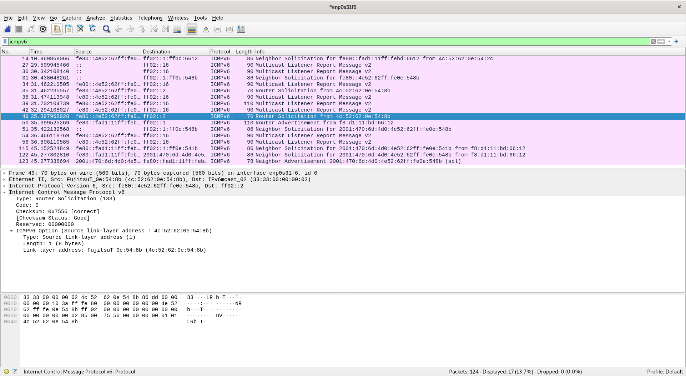
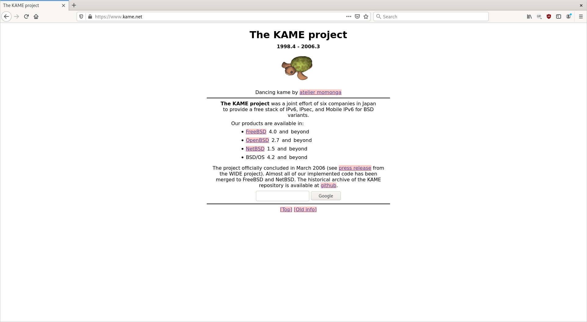
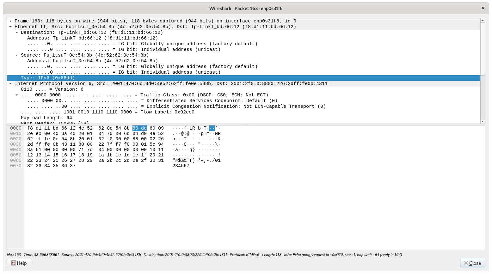
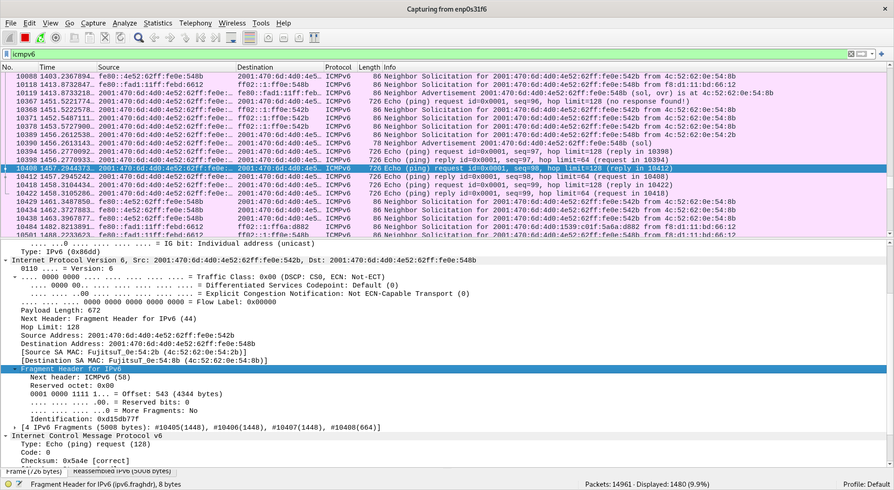

---
author: [Jakob Waibel, Daniel Hiller, Elia Wüstner, Felix Pojtinger]
date: "2021-11-09"
subject: "Praktikum Rechnernetze: Protokoll zu Versuch 4 (IPv6) von Gruppe 1"
keywords: [Rechnernetze, Protokoll, Versuch, HdM Stuttgart]
subtitle: "Protokoll zu Versuch 4 (IPv6) von Gruppe 1"
lang: "de"
...

# Praktikum Rechnernetze

## Einführung

### Mitwirken

Diese Materialien basieren auf [Professor Kiefers "Praktikum Rechnernetze"-Vorlesung der HdM Stuttgart](https://www.hdm-stuttgart.de/vorlesung_detail?vorlid=j212254).

**Sie haben einen Fehler gefunden oder haben einen Verbesserungsvorschlag?** Bitte eröffnen Sie ein Issue auf GitHub ([github.com/pojntfx/uni-netpractice-notes](https://github.com/pojntfx/uni-netpractice-notes)):

{ width=150px }

Wenn ihnen die Materialien gefallen, würden wir uns über einen GitHub-Stern sehr freuen.

### Lizenz

Dieses Dokument und der enthaltene Quelltext ist freie Kultur bzw. freie Software.

{ width=128px }

Uni Network Practice Notes (c) 2021 Jakob Waibel, Daniel Hiller, Elia Wüstner, Felix Pojtinger

SPDX-License-Identifier: AGPL-3.0

\newpage

## IPv6-Addressen

**Erkunden sie unter Windows und Ubuntu, wie viele IP-Adressen dem physikalischen Interface zugeordnet sind.**

```shell
$ ip addr
1: lo: <LOOPBACK,UP,LOWER_UP> mtu 65536 qdisc noqueue state UNKNOWN group default qlen 1000
    link/loopback 00:00:00:00:00:00 brd 00:00:00:00:00:00
    inet 127.0.0.1/8 scope host lo
       valid_lft forever preferred_lft forever
2: enp0s31f6: <BROADCAST,MULTICAST,UP,LOWER_UP> mtu 1500 qdisc pfifo_fast state UP group default qlen 1000
    link/ether 4c:52:62:0e:54:8b brd ff:ff:ff:ff:ff:ff
    inet 141.62.66.5/24 brd 141.62.66.255 scope global dynamic enp0s31f6
       valid_lft 13993sec preferred_lft 13993sec
```

```plaintext
# /etc/sysctl.conf
net.ipv6.conf.all.disable_ipv6 = 0
net.ipv6.conf.default.disable_ipv6 = 0
net.ipv6.conf.lo.disable_ipv6 = 0
```

```shell
$ sudo sysctl -p
```

```shell
$ ip a
1: lo: <LOOPBACK,UP,LOWER_UP> mtu 65536 qdisc noqueue state UNKNOWN group default qlen 1000
    link/loopback 00:00:00:00:00:00 brd 00:00:00:00:00:00
    inet 127.0.0.1/8 scope host lo
       valid_lft forever preferred_lft forever
    inet6 ::1/128 scope host
       valid_lft forever preferred_lft forever
2: enp0s31f6: <BROADCAST,MULTICAST,UP,LOWER_UP> mtu 1500 qdisc pfifo_fast state UP group default qlen 1000
    link/ether 4c:52:62:0e:54:8b brd ff:ff:ff:ff:ff:ff
    inet 141.62.66.5/24 brd 141.62.66.255 scope global dynamic enp0s31f6
       valid_lft 13621sec preferred_lft 13621sec
    inet6 2001:470:6d:4d0:4e52:62ff:fe0e:548b/64 scope global dynamic mngtmpaddr
       valid_lft 86367sec preferred_lft 14367sec
    inet6 fe80::4e52:62ff:fe0e:548b/64 scope link
       valid_lft forever preferred_lft forever
```

Es sind 3 Addressen zu finden; eine Host-Local-Addresse, eine Global-Unique-Addresse und eine Link-Local-Addresse.

Nun wird noch IPv4 deaktiviert:

```shell
$ sudo ip addr delete 141.62.66.5/24 dev enp0s31f6
$ ip a
1: lo: <LOOPBACK,UP,LOWER_UP> mtu 65536 qdisc noqueue state UNKNOWN group default qlen 1000
    link/loopback 00:00:00:00:00:00 brd 00:00:00:00:00:00
    inet 127.0.0.1/8 scope host lo
       valid_lft forever preferred_lft forever
    inet6 ::1/128 scope host
       valid_lft forever preferred_lft forever
2: enp0s31f6: <BROADCAST,MULTICAST,UP,LOWER_UP> mtu 1500 qdisc pfifo_fast state UP group default qlen 1000
    link/ether 4c:52:62:0e:54:8b brd ff:ff:ff:ff:ff:ff
    inet6 2001:470:6d:4d0:4e52:62ff:fe0e:548b/64 scope global dynamic mngtmpaddr
       valid_lft 86328sec preferred_lft 14328sec
    inet6 fe80::4e52:62ff:fe0e:548b/64 scope link
       valid_lft forever preferred_lft forever
```

**Woraus setzt sich die Link-Lokale-Adresse zusammen und erkennen Sie das EUI-64 Format?**

Die Link-Lokale-Addresse setzt sich aus Prefix `fe80` und 48 Füll-Nullen sowie und der mit EUI-64 erweiterten MAC-Addresse zusammen.

Das EUI-64-Format lässt sich mittels `fe0e` bei `2001:470:6d:4d0:4e52:62ff:fe0e:548b/64` und `fe80::4e52:62ff:fe0e:548b/64` erkennen.

**Wie lautet der Prefix und die Host-ID der Global-Unicast-Adresse?**

Prefix: `2001:470:6d:4d0`

Host-ID: `4e52:62ff:fe0e:548b`

**Testen Sie die Netzwerkverbindung zwischen dem Linux und dem Windows-Rechner mit einem Ping (IPv6)?**

Vom Linux-Host zum Windows-Host:

```shell
$ ping6 2001:470:6d:4d0:4e52:62ff:fe0e:542b
PING 2001:470:6d:4d0:4e52:62ff:fe0e:542b(2001:470:6d:4d0:4e52:62ff:fe0e:542b) 56 data bytes
64 bytes from 2001:470:6d:4d0:4e52:62ff:fe0e:542b: icmp_seq=1 ttl=64 time=1.33 ms
64 bytes from 2001:470:6d:4d0:4e52:62ff:fe0e:542b: icmp_seq=2 ttl=64 time=0.790 ms
64 bytes from 2001:470:6d:4d0:4e52:62ff:fe0e:542b: icmp_seq=3 ttl=64 time=0.787 ms
64 bytes from 2001:470:6d:4d0:4e52:62ff:fe0e:542b: icmp_seq=4 ttl=64 time=0.787 ms
64 bytes from 2001:470:6d:4d0:4e52:62ff:fe0e:542b: icmp_seq=5 ttl=64 time=0.775 ms
64 bytes from 2001:470:6d:4d0:4e52:62ff:fe0e:542b: icmp_seq=6 ttl=64 time=0.808 ms
^C
--- 2001:470:6d:4d0:4e52:62ff:fe0e:542b ping statistics ---
6 packets transmitted, 6 received, 0% packet loss, time 5078ms
rtt min/avg/max/mdev = 0.775/0.879/1.327/0.200 ms
```

**Lassen Sie sich die Routen anzeigen und ermitteln Sie die „Default Route“**

$ ip -6 route show
2001:470:6d:4d0::/64 dev enp0s31f6 proto kernel metric 256 expires 86097sec pref medium
fe80::/64 dev enp0s31f6 proto kernel metric 256 pref medium
default via fe80::fad1:11ff:febd:6612 dev enp0s31f6 proto ra metric 1024 expires 1497sec hoplimit 64 pref medium

**Wer antwortet auf Multicast-Addressen?**

```shell
$ ping6 ff02::1%enp0s31f6 # Stations
PING ff02::1%enp0s31f6(ff02::1%enp0s31f6) 56 data bytes
64 bytes from fe80::4e52:62ff:fe0e:548b%enp0s31f6: icmp_seq=1 ttl=64 time=0.057 ms
64 bytes from fe80::268:ebff:feb3:3487%enp0s31f6: icmp_seq=1 ttl=64 time=0.292 ms
64 bytes from fe80::fad1:11ff:febd:6612%enp0s31f6: icmp_seq=1 ttl=64 time=0.292 ms
64 bytes from fe80::dcab:6dff:fef8:ad58%enp0s31f6: icmp_seq=1 ttl=64 time=0.359 ms
64 bytes from fe80::b858:f6ff:fe60:f766%enp0s31f6: icmp_seq=1 ttl=64 time=0.359 ms
64 bytes from fe80::a4e2:e2ff:fecd:e47d%enp0s31f6: icmp_seq=1 ttl=64 time=0.359 ms
64 bytes from fe80::4e52:62ff:fe0e:5401%enp0s31f6: icmp_seq=1 ttl=64 time=0.426 ms
64 bytes from fe80::4e52:62ff:fe0e:e0e6%enp0s31f6: icmp_seq=1 ttl=64 time=0.426 ms
64 bytes from fe80::4e52:62ff:fe0e:545d%enp0s31f6: icmp_seq=1 ttl=64 time=0.426 ms
64 bytes from fe80::4e52:62ff:fe0e:e0e9%enp0s31f6: icmp_seq=1 ttl=64 time=0.478 ms
64 bytes from fe80::b04f:d6ff:fe65:93c7%enp0s31f6: icmp_seq=1 ttl=64 time=0.478 ms
64 bytes from fe80::268:ebff:feb3:3358%enp0s31f6: icmp_seq=1 ttl=64 time=0.704 ms
64 bytes from fe80::6039:f6ff:fe7b:b087%enp0s31f6: icmp_seq=1 ttl=64 time=0.777 ms
64 bytes from fe80::24c5:4ff:fe8a:faeb%enp0s31f6: icmp_seq=1 ttl=64 time=0.777 ms
64 bytes from fe80::e0a2:5fff:fe18:2fe8%enp0s31f6: icmp_seq=1 ttl=64 time=0.777 ms
64 bytes from fe80::74a8:deff:fe8b:4aa%enp0s31f6: icmp_seq=1 ttl=64 time=0.778 ms
64 bytes from fe80::6cfd:9fff:fe6d:3174%enp0s31f6: icmp_seq=1 ttl=64 time=0.841 ms
64 bytes from fe80::8461:e8ff:fec4:28e5%enp0s31f6: icmp_seq=1 ttl=64 time=0.841 ms
64 bytes from fe80::40bc:f2ff:fec8:62dd%enp0s31f6: icmp_seq=1 ttl=64 time=0.841 ms
64 bytes from fe80::f02a:80ff:fe19:5233%enp0s31f6: icmp_seq=1 ttl=64 time=0.841 ms
64 bytes from fe80::609:73ff:feaa:8ac0%enp0s31f6: icmp_seq=1 ttl=64 time=0.888 ms
64 bytes from fe80::609:73ff:feaa:8b80%enp0s31f6: icmp_seq=1 ttl=64 time=0.971 ms
64 bytes from fe80::215:99ff:fe7f:339d%enp0s31f6: icmp_seq=1 ttl=64 time=1.21 ms
^C
--- ff02::1%enp0s31f6 ping statistics ---
1 packets transmitted, 1 received, +22 duplicates, 0% packet loss, time 0ms
rtt min/avg/max/mdev = 0.057/0.617/1.210/0.274 ms
$ ping6 ff02::2%enp0s31f6 # Router
PING ff02::2%enp0s31f6(ff02::2%enp0s31f6) 56 data bytes
64 bytes from fe80::fad1:11ff:febd:6612%enp0s31f6: icmp_seq=1 ttl=64 time=0.299 ms
64 bytes from fe80::268:ebff:feb3:3487%enp0s31f6: icmp_seq=1 ttl=64 time=0.525 ms
64 bytes from fe80::268:ebff:feb3:3358%enp0s31f6: icmp_seq=1 ttl=64 time=0.675 ms
64 bytes from fe80::fad1:11ff:febd:6612%enp0s31f6: icmp_seq=2 ttl=64 time=0.302 ms
64 bytes from fe80::268:ebff:feb3:3487%enp0s31f6: icmp_seq=2 ttl=64 time=0.465 ms
64 bytes from fe80::268:ebff:feb3:3358%enp0s31f6: icmp_seq=2 ttl=64 time=0.697 ms
64 bytes from fe80::fad1:11ff:febd:6612%enp0s31f6: icmp_seq=3 ttl=64 time=0.294 ms
64 bytes from fe80::268:ebff:feb3:3487%enp0s31f6: icmp_seq=3 ttl=64 time=0.294 ms
64 bytes from fe80::268:ebff:feb3:3358%enp0s31f6: icmp_seq=3 ttl=64 time=0.648 ms
^C
--- ff02::2%enp0s31f6 ping statistics ---
3 packets transmitted, 3 received, +6 duplicates, 0% packet loss, time 2057ms
rtt min/avg/max/mdev = 0.294/0.466/0.697/0.165 ms
```

TODO: Add interpretation

**Können Sie einzelne Notes anhand der MAC-Adresse (siehe Anhang) identifizieren?**

Die Station `fe80::fad1:11ff:febd:6612` konnte erkannt werden; diese ist wie zuvor schon beschrieben (`ip -6 route show`) das Standardgateway

**Wieviele unterschiedliche Stationen antworten darauf, oder wieviele aktive Komponenten im RN-LAN arbeiten bereits mit IPv6?**

Es sind 23 IPv6-Stationen im Netzwerk; die Addressen der Router `fe80::fad1:11ff:febd:6612`, `fe80::268:ebff:feb3:3487` und `fe80::268:ebff:feb3:3358` finden sich wie oben zu erkennen ist auch im 1. `ping`-Command.

## IPv6 und DNS

**Identifizieren Sie mit Wireshark die Pakete mit denen der Router im Netz das Prefix mitteilt. Welches Protokoll wird dafür benutzt und um welchen Type handelt es sich und wie lautet die Zieladresse des Pakets?**

Protokoll: ICMPv6
Type: Router Solicitation bzw. Router Advertisement




**Kommen Sie raus in das Internet? Was ist dazu noch erforderlich?**

```shell
praktikum@rn05:~$ ping google.com
PING google.com(fra24s06-in-x0e.1e100.net (2a00:1450:4001:829::200e)) 56 data bytes
64 bytes from fra24s06-in-x0e.1e100.net (2a00:1450:4001:829::200e): icmp_seq=1 ttl=117 time=55.7 ms
^C
--- google.com ping statistics ---
1 packets transmitted, 1 received, 0% packet loss, time 0ms
rtt min/avg/max/mdev = 55.651/55.651/55.651/0.000 ms
praktikum@rn05:~$ sudo ip addr del 141.62.66.5/24 dev enp0s31f6
praktikum@rn05:~$ ip a
1: lo: <LOOPBACK,UP,LOWER_UP> mtu 65536 qdisc noqueue state UNKNOWN group default qlen 1000
    link/loopback 00:00:00:00:00:00 brd 00:00:00:00:00:00
    inet 127.0.0.1/8 scope host lo
       valid_lft forever preferred_lft forever
    inet6 ::1/128 scope host
       valid_lft forever preferred_lft forever
2: enp0s31f6: <BROADCAST,MULTICAST,UP,LOWER_UP> mtu 1500 qdisc pfifo_fast state UP group default qlen 1000
    link/ether 4c:52:62:0e:54:8b brd ff:ff:ff:ff:ff:ff
    inet6 2001:470:6d:4d0:4e52:62ff:fe0e:548b/64 scope global dynamic mngtmpaddr
       valid_lft 86055sec preferred_lft 14055sec
    inet6 fe80::4e52:62ff:fe0e:548b/64 scope link
       valid_lft forever preferred_lft forever
praktikum@rn05:~$ ping 8.8.8.8
ping: connect: Network is unreachable
praktikum@rn05:~$ ping google.com
ping: google.com: Name or service not known
praktikum@rn05:~$ ping6 2a00:1450:4001:829::200e
PING 2a00:1450:4001:829::200e(2a00:1450:4001:829::200e) 56 data bytes
64 bytes from 2a00:1450:4001:829::200e: icmp_seq=1 ttl=117 time=55.9 ms
64 bytes from 2a00:1450:4001:829::200e: icmp_seq=2 ttl=117 time=56.0 ms
^C
--- 2a00:1450:4001:829::200e ping statistics ---
2 packets transmitted, 2 received, 0% packet loss, time 1001ms
rtt min/avg/max/mdev = 55.925/55.962/56.000/0.037 ms
```

Wie zu erkennen ist, können DNS-Requests noch nicht beantwortet werden (`sudo ip addr del 141.62.66.5/24 dev enp0s31f6` deaktiviert hier IPv6), wird jedoch die IPv6-Addresse `2a00:1450:4001:829::200e` direkt verwendet, so kann eine direkte Verbindung (hier z.B. zu Google) aufgebaut werden. Um das Internet jedoch im vollem Umfang nutzen zu können, muss noch ein IPv6-fähiger Nameserver eingerichtet werden.

**Rufen Sie die Webseite www.kame.net mittels IPv6-Adresse auf (kame.net ist manchmal instabil, alternativ versuchen Sie ipv6.google.com)**

Zuerst wurde ein IPv6-fähiger Nameserver eingerichtet und getested:

```shell
$ cat /etc/resolv.conf
nameserver 2001:4860:4860::8888
$ ping6 2001:4860:4860::8888
PING 2001:4860:4860::8888(2001:4860:4860::8888) 56 data bytes
64 bytes from 2001:4860:4860::8888: icmp_seq=1 ttl=119 time=34.1 ms
^C
--- 2001:4860:4860::8888 ping statistics ---
1 packets transmitted, 1 received, 0% packet loss, time 0ms
rtt min/avg/max/mdev = 34.118/34.118/34.118/0.000 ms
$ dig @2001:4860:4860::8888 +noall +answer google.com AAAA
google.com.		300	IN	AAAA	2a00:1450:4005:802::200e
$ dig +noall +answer google.com AAAA
google.com.		300	IN	AAAA	2a00:1450:4005:802::200e
$ ping google.com
PING google.com(ham02s21-in-x0e.1e100.net (2a00:1450:4005:802::200e)) 56 data bytes
64 bytes from ham02s21-in-x0e.1e100.net (2a00:1450:4005:802::200e): icmp_seq=1 ttl=119 time=26.5 ms
^C
--- google.com ping statistics ---
1 packets transmitted, 1 received, 0% packet loss, time 0ms
rtt min/avg/max/mdev = 26.463/26.463/26.463/0.000 ms
```

`www.kame.net` zeigt eine drehende Schildkröte:



**Mit welcher IPv6-Adresse sie im Netz unterwegs sind, zeigt die Seite http://www.heise.de/netze/tools/meine-ip-adresse an**

> Wir haben hierzu den Dienst `ifconfig.io` verwendet.

```shell
$ curl https://ifconfig.io
2001:470:6d:4d0:4e52:62ff:fe0e:548b
```

**Welche IPv6-Adresse hat http://www.google.com?**

```shell
$ dig +noall +answer google.com AAAA
google.com.		300	IN	AAAA	2a00:1450:4005:802::200e
```

**Was ist das besondere an der IPv6-Adresse von Facebook?**

```shell
$ dig +noall +answer facebook.com AAAA
facebook.com.		300	IN	AAAA	2a03:2880:f131:83:face:b00c:0:25de
```

Facebook hat das 5. und 6. Hextet `face` und `b00c`, als Anspielung zum Firmennamen, in deren IPv6-Addresse.

**Lösen Sie mittels nslookup oder dig die URL openldap.org in die IPv6-Adresse auf!**

```shell
$ dig +noall +answer openldap.org AAAA
openldap.org.		300	IN	AAAA	2600:3c00:e000:2d3::1
```

## Neighbor Solicitation

**Starten Sie den „Kabelhai“ und pingen Sie ihren Nachbarrechner. Welches Protokoll/Type wird anstatt ARP zur Ermittlung der MAC-Adressen verwendet?**

```shell
$ sudo ip neigh flush dev enp0s31f6
$ ping6 fe80::fad1:11ff:febd:6612
PING fe80::fad1:11ff:febd:6612(fe80::fad1:11ff:febd:6612) 56 data bytes
64 bytes from fe80::fad1:11ff:febd:6612%enp0s31f6: icmp_seq=1 ttl=255 time=0.568 ms
^C
--- fe80::fad1:11ff:febd:6612 ping statistics ---
1 packets transmitted, 1 received, 0% packet loss, time 0ms
rtt min/avg/max/mdev = 0.568/0.568/0.568/0.000 ms
```


Hier wird ICMPv6 mit den Types Neighbor Solicitation und Neigbor Advertisement verwendet.

**Welche Zieladresse wird im ersten Neighbour-Paket verwendet und um welchen Adresstyp handelt es sich?**

Es wird eine Multicast-Addresse (`ff02::1:ffbd:6612`) verwendet.

## IPv6-Header

**Starten Sie Wireshark und senden sie ein ping an einen IPv6-fähigen Webserver (www.ix.de, http://www.heise.de, http://www.kame.net), stoppen Sie Wireshark und schauen sich den Trace an.**

```shell
$ ping www.kame.net
PING www.kame.net(2001:2f0:0:8800:226:2dff:fe0b:4311 (2001:2f0:0:8800:226:2dff:fe0b:4311)) 56 data bytes
64 bytes from 2001:2f0:0:8800:226:2dff:fe0b:4311 (2001:2f0:0:8800:226:2dff:fe0b:4311): icmp_seq=1 ttl=48 time=317 ms
64 bytes from 2001:2f0:0:8800:226:2dff:fe0b:4311 (2001:2f0:0:8800:226:2dff:fe0b:4311): icmp_seq=2 ttl=48 time=271 ms
64 bytes from 2001:2f0:0:8800:226:2dff:fe0b:4311 (2001:2f0:0:8800:226:2dff:fe0b:4311): icmp_seq=3 ttl=48 time=273 ms
64 bytes from 2001:2f0:0:8800:226:2dff:fe0b:4311 (2001:2f0:0:8800:226:2dff:fe0b:4311): icmp_seq=4 ttl=48 time=271 ms
64 bytes from 2001:2f0:0:8800:226:2dff:fe0b:4311 (2001:2f0:0:8800:226:2dff:fe0b:4311): icmp_seq=5 ttl=48 time=271 ms
64 bytes from 2001:2f0:0:8800:226:2dff:fe0b:4311 (2001:2f0:0:8800:226:2dff:fe0b:4311): icmp_seq=6 ttl=48 time=271 ms
64 bytes from 2001:2f0:0:8800:226:2dff:fe0b:4311 (2001:2f0:0:8800:226:2dff:fe0b:4311): icmp_seq=7 ttl=48 time=271 ms
64 bytes from 2001:2f0:0:8800:226:2dff:fe0b:4311 (2001:2f0:0:8800:226:2dff:fe0b:4311): icmp_seq=8 ttl=48 time=272 ms
^C
--- www.kame.net ping statistics ---
8 packets transmitted, 8 received, 0% packet loss, time 7008ms
rtt min/avg/max/mdev = 271.343/277.307/316.896/14.971 ms
```


**Wodurch wird im Ethernet-Frame auf das eingepackte IPv6 hingewiesen?**



Der Type IPv6 im Ethernet-Frame lässt auf das "eingepackte" IPv6 schließen.

**Welche Bedeutung haben folgende Felder des IPv6-Headers und gibt es Entsprechungen in IPv4?**

TODO: Add information about different header fields.

|      | Version | Traffic | Class | Flow | Label | Payload | Length | Hop Limit |
| ---- | ------- | ------- | ----- | ---- | ----- | ------- | ------ | --------- |
| IPv6 |         |         |       |      |       |         |        |           |
| IPv4 |         |         |       |      |       |         |        |           |

**Senden Sie nun ein 5000 Byte großes Paket vom Windows-PC an den Ubuntu-PC und schauen sich die Abfolge der Pakete an**

```shell
# TODO: Add command with `-l 5000` flag
```


**Welcher Wert taucht im Next-Header-Feld Ihres IPv6 Headers auf?**

Hier tauch der Fragment-Header auf.


**Welche Bedeutung haben die unterschiedlichen Felder des Fragmentation Headers, oder anders gefragt; wie setzt IPv6 die Pakete wieder zusammen?**

TODO: Add interpretation



## Privacy Extension

**Tragen Sie weitere Informationen zur „Privacy Extension“ (vor allem auch zur Konfiguration unter Windows und Ubuntu) zusammen und versuchen hier im Versuch die Einstellungen für die „Privacy Extension“ auf beiden Rechnern (Windows und Ubuntu) zu realisieren.**

TODO: Add research results

**Mit welchen IPv6-Adressen sind sie nach dem Aktivieren der Privacy Extension im Internet unterwegs?**

TODO: Add research results

## Feste IPv6-Addressen

**Weisen Sie in dieser Aufgabe ihrem Netzwerkinterface eine feste sinnvolle (heißt: Der Prefix ist weiterhin gültig) IPv6-Adresse zu.**

```shell
$ ip a
1: lo: <LOOPBACK,UP,LOWER_UP> mtu 65536 qdisc noqueue state UNKNOWN group default qlen 1000
    link/loopback 00:00:00:00:00:00 brd 00:00:00:00:00:00
    inet 127.0.0.1/8 scope host lo
       valid_lft forever preferred_lft forever
    inet6 ::1/128 scope host
       valid_lft forever preferred_lft forever
2: enp0s31f6: <BROADCAST,MULTICAST,UP,LOWER_UP> mtu 1500 qdisc pfifo_fast state UP group default qlen 1000
    link/ether 4c:52:62:0e:54:8b brd ff:ff:ff:ff:ff:ff
    inet6 2001:470:6d:4d0:4e52:62ff:fe0e:548b/64 scope global dynamic mngtmpaddr
       valid_lft 86255sec preferred_lft 14255sec
    inet6 fe80::4e52:62ff:fe0e:548b/64 scope link
       valid_lft forever preferred_lft forever
praktikum@rn05:~$ sudo ip addr add 2001:470:6d:4d0:4e52:62ff:fe0e:548c/64 dev enp0s31f6
praktikum@rn05:~$ ip a
1: lo: <LOOPBACK,UP,LOWER_UP> mtu 65536 qdisc noqueue state UNKNOWN group default qlen 1000
    link/loopback 00:00:00:00:00:00 brd 00:00:00:00:00:00
    inet 127.0.0.1/8 scope host lo
       valid_lft forever preferred_lft forever
    inet6 ::1/128 scope host
       valid_lft forever preferred_lft forever
2: enp0s31f6: <BROADCAST,MULTICAST,UP,LOWER_UP> mtu 1500 qdisc pfifo_fast state UP group default qlen 1000
    link/ether 4c:52:62:0e:54:8b brd ff:ff:ff:ff:ff:ff
    inet6 2001:470:6d:4d0:4e52:62ff:fe0e:548c/64 scope global
       valid_lft forever preferred_lft forever
    inet6 2001:470:6d:4d0:4e52:62ff:fe0e:548b/64 scope global dynamic mngtmpaddr
       valid_lft 86207sec preferred_lft 14207sec
    inet6 fe80::4e52:62ff:fe0e:548b/64 scope link
       valid_lft forever preferred_lft forever
```

**Warum sollten Sie jetzt alle übrigen IPv6-Adressen löschen?**

TODO: Add interpretation

```shell
$ sudo ip addr del 2001:470:6d:4d0:4e52:62ff:fe0e:548b/64 dev enp0s31f6
$ ip a
1: lo: <LOOPBACK,UP,LOWER_UP> mtu 65536 qdisc noqueue state UNKNOWN group default qlen 1000
    link/loopback 00:00:00:00:00:00 brd 00:00:00:00:00:00
    inet 127.0.0.1/8 scope host lo
       valid_lft forever preferred_lft forever
    inet6 ::1/128 scope host
       valid_lft forever preferred_lft forever
2: enp0s31f6: <BROADCAST,MULTICAST,UP,LOWER_UP> mtu 1500 qdisc pfifo_fast state UP group default qlen 1000
    link/ether 4c:52:62:0e:54:8b brd ff:ff:ff:ff:ff:ff
    inet6 2001:470:6d:4d0:4e52:62ff:fe0e:548c/64 scope global
       valid_lft forever preferred_lft forever
    inet6 fe80::4e52:62ff:fe0e:548b/64 scope link
       valid_lft forever preferred_lft forever
```

**Reicht das aus?**

TODO: Add interpretation

**Konfigurieren Sie die statische IPv6-Adresse über /etc/network/interfaces. Was wird dadurch verhindert? (U. U. müssen sie mit ifdown und ifup die Schnittstelle neu starten**

```plaintext
# /etc/network/interfaces
auto enp0s31f6
  allow-hotplug enp0s31f6
  iface enp0s31f6 inet6 static
        address 2001:470:6d:4d0:4e52:62ff:fe0e:548c
        netmask 64
```

```shell
$ sudo ifdown enp0s31f6
$ sudo ifup enp0s31f6
Waiting for DAD... Done
$ ip a
1: lo: <LOOPBACK,UP,LOWER_UP> mtu 65536 qdisc noqueue state UNKNOWN group default qlen 1000
    link/loopback 00:00:00:00:00:00 brd 00:00:00:00:00:00
    inet 127.0.0.1/8 scope host lo
       valid_lft forever preferred_lft forever
    inet6 ::1/128 scope host
       valid_lft forever preferred_lft forever
2: enp0s31f6: <BROADCAST,MULTICAST,UP,LOWER_UP> mtu 1500 qdisc pfifo_fast state UP group default qlen 1000
    link/ether 4c:52:62:0e:54:8b brd ff:ff:ff:ff:ff:ff
    inet6 2001:470:6d:4d0:4e52:62ff:fe0e:548c/64 scope global
       valid_lft forever preferred_lft forever
    inet6 fe80::4e52:62ff:fe0e:548b/64 scope link
       valid_lft forever preferred_lft forever
$ ping www.kame.net
PING www.kame.net(2001:2f0:0:8800:226:2dff:fe0b:4311 (2001:2f0:0:8800:226:2dff:fe0b:4311)) 56 data bytes
64 bytes from 2001:2f0:0:8800:226:2dff:fe0b:4311 (2001:2f0:0:8800:226:2dff:fe0b:4311): icmp_seq=1 ttl=48 time=280 ms
64 bytes from 2001:2f0:0:8800:226:2dff:fe0b:4311 (2001:2f0:0:8800:226:2dff:fe0b:4311): icmp_seq=2 ttl=48 time=274 ms
^C64 bytes from 2001:2f0:0:8800:226:2dff:fe0b:4311: icmp_seq=3 ttl=48 time=275 ms

--- www.kame.net ping statistics ---
3 packets transmitted, 3 received, 0% packet loss, time 2003ms
rtt min/avg/max/mdev = 274.357/276.472/280.370/2.759 ms
```

TODO: Add interpretation

**Mit welcher IPv6-Adresse sind sie jetzt im Netz unterwegs? Die Seite http://www.heise.de/netze/tools/meine-ip-adresse gibt Aufschluss.**

TODO: Add interpretation

```shell
$ curl https://ipconfig.io
2001:470:6d:4d0:4e52:62ff:fe0e:548c
```

## Lease-Zeiten

**Die Werte für "Maximale bevorzugte Gültigkeitsdauer" und "Maximale Gültigkeitsdauer" setzt man in Windows über die Schlüssel maxpreferredlifetime und maxvalidlifetime, die Zeitangaben in Tagen (d), Stunden (h), Minuten (m) und Sekunden (s) entgegennehmen. Wie sind diese Parameter bei Ihnen gesetzt?**

TODO: Add interpretation

**Halbieren Sie die "Maximale bevorzugte Gültigkeitsdauer" auf den Rechnern.**

TODO: Add interpretation

**Verringern Sie ebenso die Zeitspanne, in der Windows über eine temporäre IPv6-Adresse eingehende Pakete empfängt.**

TODO: Add interpretation

**Stellen Sie den Zusammenhang zwischen Preferred Lifetime und Valid Liftime anschaulich dar**

TODO: Add interpretation

## OS-Updates

```shell
$ sudo ip addr del 141.62.66.5/24 dev enp0s31f6
$ sudo apt update
Hit:1 http://deb.debian.org/debian bullseye InRelease
Hit:2 http://security.debian.org bullseye-security InRelease
Get:3 http://deb.debian.org/debian bullseye-updates InRelease [39.4 kB]
Hit:4 http://ppa.launchpad.net/ansible/ansible/ubuntu bionic InRelease
Fetched 39.4 kB in 5s (7,169 B/s)
Reading package lists... Done
Building dependency tree... Done
Reading state information... Done
1 package can be upgraded. Run 'apt list --upgradable' to see it.
$ sudo apt upgrade -y
Reading package lists... Done
Building dependency tree... Done
Reading state information... Done
Calculating upgrade... Done
The following packages will be upgraded:
  tzdata
1 upgraded, 0 newly installed, 0 to remove and 0 not upgraded.
Need to get 0 B/284 kB of archives.
After this operation, 0 B of additional disk space will be used.
apt-listchanges: Reading changelogs...
Preconfiguring packages ...
(Reading database ... 199845 files and directories currently installed.)
Preparing to unpack .../tzdata_2021a-1+deb11u2_all.deb ...
Unpacking tzdata (2021a-1+deb11u2) over (2021a-1+deb11u1) ...
Setting up tzdata (2021a-1+deb11u2) ...

Current default time zone: 'Europe/Berlin'
Local time is now:      Tue Nov  9 16:52:29 CET 2021.
Universal Time is now:  Tue Nov  9 15:52:29 UTC 2021.
Run 'dpkg-reconfigure tzdata' if you wish to change it.
```
